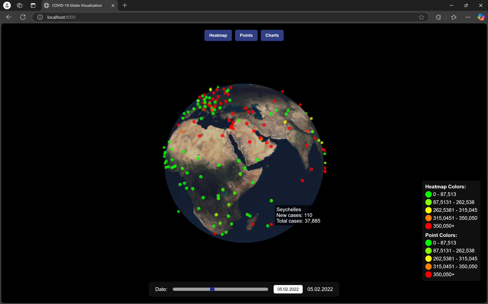
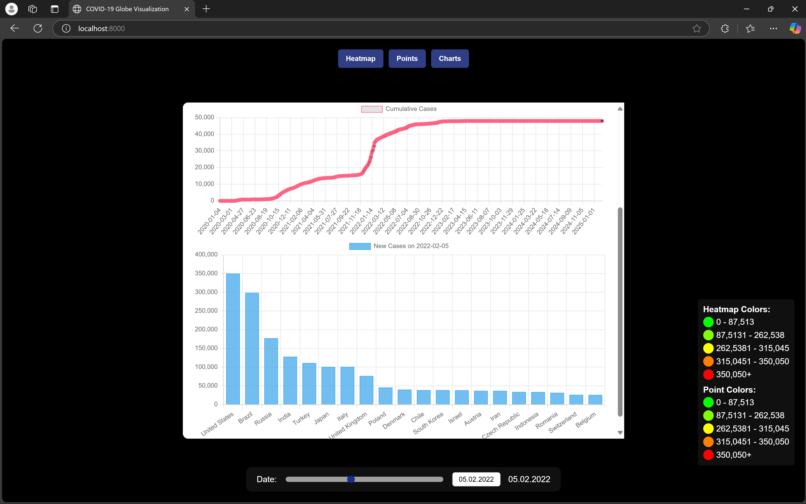

# COVID-19 Globe Visualization

This project presents an interactive 3D globe visualization of COVID-19 data, including daily new cases and cumulative cases, using Three.js for the globe and Chart.js for supplementary charts.  It allows users to explore the pandemic's progression over time and across different countries.  The project emphasizes dynamic data loading, interactive controls, and multiple visualization modes (points and heatmap).



## Features

*   **Interactive 3D Globe:**  A rotatable, zoomable globe displays COVID-19 data.  Users can interact with the globe using mouse controls (drag to rotate, scroll to zoom).
*   **Data Visualization Modes:**
    *   **Points:** Displays individual points on the globe representing the number of new cases in each country.  The color of each point represents the magnitude of cases, ranging from green (low) to red (high).
    *   **Heatmap:**  Overlays a heatmap on the globe, coloring countries based on the number of new cases.  The color intensity corresponds to case numbers, using a green-to-red gradient.
*   **Time Slider and Date Input:** Users can select a specific date to view the data for that day.  A slider allows for quick navigation through the timeline, and a date input field provides precise date selection (DD.MM.YYYY format).
*   **Dynamic Legend:**  A color-coded legend displays the numerical ranges corresponding to the colors used in both the points and heatmap modes. The legend dynamically updates based on the maximum number of cases for the selected date.
*   **Interactive Tooltips:**  Hovering over a country (in either points or heatmap mode) displays a tooltip showing the country's name, new cases, and total cases for the selected date.
*   **Data Charts:**  Clicking the "Charts" button opens a modal window containing three charts:
    *   **New Cases Over Time:** A line chart showing the trend of new cases over the entire dataset's time range.
    *   **Cumulative Cases Over Time:**  A line chart showing the trend of cumulative cases over time.
    *   **Top 20 Countries (New Cases):** A bar chart displaying the top 20 countries with the highest number of new cases for the currently selected date.
      
*   **Dynamic Data Loading:**  COVID-19 data is loaded from a JSON file (`processed_data_date.json`), allowing for easy updates and extensibility.
*   **Country Code Mapping:**  A robust mapping system handles inconsistencies between country codes in the COVID-19 data and the GeoJSON file used for country shapes.  It uses a combination of direct code matching, case-insensitive matching, and name-based matching with fallback mechanisms.
*   **GeoJSON Caching:** Country shapes are loaded from a GeoJSON file and cached to improve performance, avoiding redundant network requests.
*   **Responsive Design:** The visualization adapts to different screen sizes.
* **Error Handling**: Includes checks and alerts for missing or invalid data.

## Project Structure

*   **`index.html`:**  The main HTML file containing the structure of the webpage, including the canvas for the 3D globe, controls, legend, tooltip, and chart modal.
*   **`style.css`:**  The CSS file for styling the webpage elements, including the globe, controls, legend, charts, and modal.
*   **`js/app.js`:** The main JavaScript file containing the Three.js and Chart.js code for creating the globe, loading data, handling user interactions, and displaying the visualizations.
*   **`data/processed_data_date.json`:**  The JSON file containing the preprocessed COVID-19 data.  This file is generated by `prepare_data.py`.
*   **`raw_data/`:**  A directory containing the raw data files:
    *   `WHO-COVID-19-global-daily-data.csv`:  The raw COVID-19 data from the WHO.
    *  `world_country_and_usa_states_latitude_and_longitude_values.csv.xls`: Geographical data
*   **`prepare_data.py`:**  A Python script to preprocess the raw COVID-19 data and geographical data into the `processed_data_date.json` format.
*   **`generate_mapping.py`:** A Python script to create a JavaScript object, mapping the country codes.
* **`countries.geo.json`:** stores geographical data.

## Getting Started

1.  **Clone the Repository:**

    ```bash
    git clone <repository_url>
    cd <repository_directory>
    ```

2.  **Data Preparation:**

    *   Place the raw data files (`WHO-COVID-19-global-daily-data.csv` and `world_country_and_usa_states_latitude_and_longitude_values.csv.xls`) in the `raw_data` directory.  You'll need to obtain these files from their respective sources (WHO and a source for country latitude/longitude data).
    *   Run the `prepare_data.py` script to process the raw data:

        ```bash
        python prepare_data.py
        ```
        This will create the `data/processed_data_date.json` file used by the visualization.
    *   Run the `generate_mapping.py` script. It will create mapping between country codes.

        ```bash
        python generate_mapping.py
        ```
        Copy and paste generated object to app.js.
        If `countries.geo.json` is not founded, script will try to download the file.

3.  **Open in Browser:**

    Open the `index.html` file in a web browser.  No local server is required; you can open it directly (e.g., `file:///path/to/your/index.html`).

## Dependencies

*   **Three.js:** A JavaScript library for creating 3D graphics in the browser.  Included via CDN in `index.html`.
*   **OrbitControls (Three.js Addon):**  Provides camera controls for the 3D globe.  Included via CDN in `index.html`.
*   **Chart.js:**  A JavaScript library for creating charts. Included via CDN in `index.html`.
*   **Python 3.x:**  Required for running the `prepare_data.py` script.
*   **Pandas (Python Library):** Used for data manipulation in `prepare_data.py`.  Install with `pip install pandas`.

## Code Explanation (Key Parts of `app.js`)

*   **`init()`:** Initializes the Three.js scene, camera, renderer, controls, and lighting.  Also sets up event listeners for user interactions (slider, date input, buttons, window resize, mouse move).
*   **`createGlobe()`:** Creates the 3D globe using a sphere geometry and a texture loaded from an external URL.
*   **`loadData()`:**  Fetches the COVID-19 data from `processed_data_date.json` using `fetch()`.  Sets up the date slider and initializes the visualization.
*   **`updateDateLabel()`:**  Updates the displayed date label and the date input field based on the current date index.
*   **`onSliderChange()` and `onDateInputChange()`:** Event handlers for the date slider and date input, respectively.  They update the `currentDateIndex` and trigger the visualization update.
*   **`createLegend()`:**  Generates the HTML for the legend, including color swatches and numerical ranges.  It calculates the thresholds for different color categories based on the maximum number of cases for the current date.
*   **`showPoints()` and `showHeatmap()`:**  Functions to display the data in points and heatmap modes, respectively.  They handle creating and updating the Three.js objects (points or meshes) based on the current data.
*   **`loadCountryShape()`:** Loads and caches country shapes from the GeoJSON file.
* **`clearPoints()` and `clearHeatmap()`:**  Remove the points or heatmap elements from the scene.
*   **`getHeatmapColorByCases()` and `getPointColorByCases()`:**  Functions to determine the color of a point or heatmap region based on the number of cases, using a green-to-red color scale.
*   **`switchMode()`:**  Switches between the points and heatmap visualization modes.
*   **`updateVisualization()`:** A combined function to clear the previous visualization and display the selected mode.
*   **`showCharts()`:**  Creates and updates the charts in the modal window using Chart.js.  Handles destroying existing charts to prevent memory leaks.
*   **`latLongToVector3()`:** Converts latitude, longitude, and radius to a 3D vector position on the globe.
*   **`onWindowResize()`:**  Handles window resizing to maintain the correct aspect ratio of the globe.
*   **`onMouseMove()`:**  Handles mouse movement to display the tooltip with country-specific data.
*   **`animate()`:**  The animation loop that updates the controls and renders the scene.

## Data Preprocessing (`prepare_data.py`)

The `prepare_data.py` script performs the following steps:

1.  **Loads Data:** Loads the raw COVID-19 data and country coordinate data using Pandas.
2.  **Data Cleaning:**  Filters and renames columns, handles missing values, and merges the two datasets based on the country code.
3.  **Data Aggregation:** Groups the data by country and date, summing the new cases and cumulative cases.
4.  **Data Transformation:**  Transforms the data into the desired JSON format, creating a list of objects, where each object represents a country and contains its geographical coordinates and a list of daily data (date, new cases, cumulative cases).
5.  **Saves to JSON:** Saves the processed data to `data/processed_data_date.json`.

## Country code mapping(`generate_mapping.py`)
The `generate_mapping.py` script generates a JavaScript object for mapping country codes from `processed_data_date.json` to GeoJSON file country codes.

## Future Improvements

*   **Data Source Abstraction:** Make it easier to switch between different data sources (e.g., different APIs or file formats).
*   **Performance Optimization:**  For very large datasets, consider using more advanced techniques like instanced rendering or WebGL shaders for improved performance.
*   **More Visualization Options:**  Add more visualization options, such as different color palettes, point sizes, or animation effects.
*   **Additional Data Layers:**  Allow users to overlay additional data layers, such as population density or vaccination rates.
*   **User Interface Enhancements:**  Improve the user interface with more interactive elements and better controls.
*  **Mobile Support:** improve mobile device support.
* **Downloading Data:** Ability to download a processed data.
